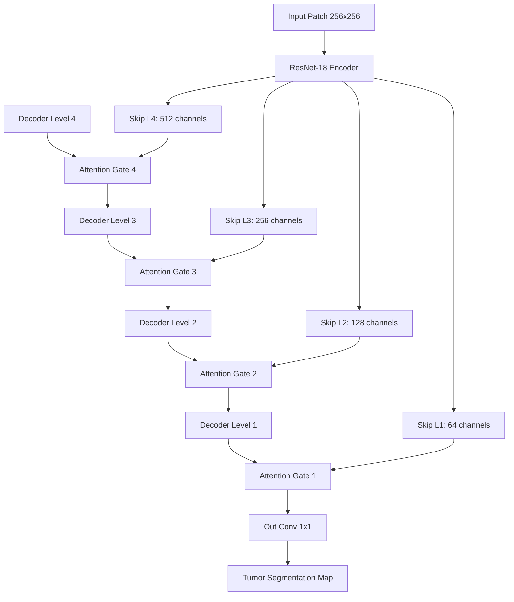

# 🔬 Histopathology Tumor Detection and Segmentation Pipeline

[](https://opensource.org/licenses/MIT)
[](https://www.python.org/downloads/)
[](https://pytorch.org/)

An end-to-end, high-performance medical image analysis pipeline designed to detect and segment tumor regions in histopathological Whole Slide Images (WSIs). This repository packages the original Jupyter Notebook workflow along with modular, standalone Python scripts.

---

## 📖 Table of Contents
1. [Key Features](#-key-features)
2. [Codebase Architecture](#-codebase-architecture)
3. [Deep Learning Models](#-deep-learning-models)
4. [Image Processing Techniques](#-image-processing-techniques)
5. [Mathematical Formulations](#-mathematical-formulations)
6. [Installation & Requirements](#-installation--requirements)
7. [Usage Guide](#-usage-guide)
8. [Evaluation Metrics](#-evaluation-metrics)

---

## 🚀 Key Features

*   **Dual Segmentation Architectures**: Implements a standard **ResNet-UNet** (ResNet-18 encoder) and an advanced **Attention-UNet** featuring soft Attention Gates in skip connections to ignore background noise.
*   **WSI Dataset Simulator**: Generates synthetic, gigapixel-like tissue slides (including simulated stroma, cell nuclei, and tumor clusters) for local verification.
*   **Macenko Stain Normalization**: Corrects lab-specific staining variations using Singular Value Decomposition (SVD) on Optical Density (OD) representations.
*   **Otsu Saturation Thresholding**: Dynamically segments foreground tissue from slide glass.
*   **Heatmap Reconstruction**: Predicts patch-level probabilities and stitches them back into a whole-slide tumor probability map.
*   **Diagnostic Metrics**: Supports stain-normalization ablation studies and Free-Response ROC (FROC) curve plotting.

---

## 📁 Codebase Architecture

```
histopathology_notebook_upload/
│
├── histopathology_tumour_detection.ipynb # Original Jupyter Notebook
├── utils_segmentation.py                 # Core image processing, normalization & simulation helper classes
├── unet_model.py                         # PyTorch ResNetUNet, AttentionUNet & DiceBCELoss definitions
├── run_notebook_pipeline.py              # Single python script representing all execution cells
├── README.md                             # Documentation
└── .gitignore                            # Excludes temporary checkpoints and local caches
```

---

## 🧬 Deep Learning Models

### 1. ResNet-UNet
Utilizes a pretrained ResNet-18 backbone as the encoder. The final classification head is removed, and intermediate resolution feature maps are forwarded to transposed convolution decoders via skip connections.

### 2. Attention-UNet
Incorporates **Attention Gates (AG)** in the skip connections. The gating signal ($g$) is extracted from the coarser decoder level, projected to an intermediate space along with the skip feature map ($x$), and used to compute attention coefficients. This isolates tumor boundaries and ignores slide artifacts.



---

## 🎨 Image Processing Techniques

### Otsu Saturation Masking
Histopathology slide backgrounds contain vast empty areas. To exclude background glass, we average the RGB channels or isolate the Saturation channel in HSV space. Otsu's thresholding minimizes the intra-class variance of the background and foreground, generating a binary tissue mask.

### Macenko Stain Normalization
H&E stained slides suffer from variations due to different scanners, thickness, and dye concentrations. The Macenko method:
1.  Converts RGB values to Optical Density (OD).
2.  Filters out background pixels with low OD.
3.  Calculates eigenvectors of the OD covariance matrix using SVD.
4.  Projects OD coordinates onto the plane of the two primary eigenvectors.
5.  Calculates extreme angles to extract Hematoxylin and Eosin stain vectors.
6.  Standardizes concentration values against a reference target.

---

## 🧮 Mathematical Formulations

### 1. Optical Density (OD) Conversion
$$\text{OD} = -\log_{10}\left(\frac{I}{I_0}\right)$$
*Where $I$ is the input intensity, and $I_0$ is the background intensity (typically 240).*

### 2. Attention Gate Coefficient
$$\alpha_{i} = \sigma\left(\psi^T \left(\text{ReLU}\left(W_x^T x_i + W_g^T g + b_g\right)\right) + b_\psi\right)$$
*Where $x_i$ is the skip feature map, $g$ is the gating signal, $W$ and $b$ are $1\times1$ convolutions and biases, and $\sigma$ is the Sigmoid activation.*

### 3. Dice Loss
$$\text{Dice Loss} = 1 - \frac{2 \sum (p_i \cdot y_i) + \epsilon}{\sum p_i + \sum y_i + \epsilon}$$
*Where $p_i$ is the predicted probability, $y_i$ is the binary target, and $\epsilon$ is a smoothing term ($10^{-6}$).*

### 4. Combined Loss
$$\text{Loss} = \text{BCEWithLogitsLoss}(p, y) + \text{Dice Loss}(p, y)$$

---

## 📥 Installation & Requirements

Ensure you have **Python 3.10+** and a CUDA-enabled GPU (optional but recommended).

Install dependencies:
```bash
pip install torch torchvision numpy matplotlib opencv-python pillow scikit-learn
```

---

## 💻 Usage Guide

### Running the Notebook
Open `histopathology_tumour_detection.ipynb` in your preferred notebook workspace (Jupyter, Kaggle, or Google Colab) to execute step-by-step training and plot visualizations.

### Running Standalone Pipeline Script
To run the complete data simulation, training loop, evaluation, and plotting pipeline directly in a terminal:
```bash
python run_notebook_pipeline.py
```

---

## 📊 Evaluation Metrics

*   **Dice Coefficient**: Measures overlap accuracy between predicted tumor boundaries and ground truth masks.
*   **Intersection over Union (IoU)**: Measures the size of the intersection divided by the union.
*   **FROC Curve (Free-Response ROC)**: Evaluates patch-level sensitivity vs. average false positives per slide.
*   **Stain Normalization Ablation Study**: Validates model robustness against severe color-shifts by comparing raw vs. Macenko-normalized crops.
